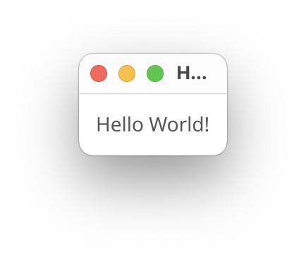

import MileageCalculatorUI from "../../images/mileage-calculator-ui.svg"

## What should we build?

Let's start with something that I always wanted for myself, and is simple as a first project as well - **A Fuel Log Mileage Calculator**.

The core of our app is a simple input form for a "fuel log" - datetime, odometer (in km), and fuel (in litre).

<div style="width: 100%; text-align: center; padding: 2em; color: var(--emphasis-color)">
  <MileageCalculatorUI />
</div>

The average fuel consumed (mileage) between two fuel logs (assuming they filled a full tank) would be the distance travelled divided by fuel filled.

Sweet, simple, and as a side effect - useful!

## Setting some groundwork (optional, but recommended)

> As a side note, I'm using the [neovim](https://neovim.io/) editor on [kitty](https://sw.kovidgoyal.net/kitty/) terminal on MacOS (it shouldn't matter, but just FYI!)

I've already named the app "Duri" - it's a Hindi word for distance. You may choose to use the same name or something else for the project. I bring it up now because we're initializing our project! Let's go, in your terminal enter:

```bash
mkdir duri && cd duri
```

Then, version control because we aren't savages -

```bash
git init -b main # Initialized empty Git repository in <...>/duri/.git/
echo "# Duri" > README.md
git add .
git commit -m "Initial Commit" # [main (root-commit) 5ca4bec] Initial Commit ...
```

Go ahead and create a new remote repository somewhere like GitHub, then link it to your local directory. You'll find the remote URL of your repo immediately after you create it - don't forget to update it (using mine will give you errors and bad vibes).

```bash
git remote add origin git@github.com:p-tupe/Duri.git
git push # ... branch 'main' set up to track 'origin/main'.
```

And there we go, now we can make a mess and not worry about it. Go back to the remote repo on your browser and ensure you see the new README up there.

## A new go project!

> If you don't already have [go](https://go.dev/) installed, please do that first.

Aight, let's setup the stuff we need to start actual development. We're still in the `duri` directory.

First, initialize our go project:

```bash
go mod init github.com/p-tupe/Duri
# go: creating new go.mod: module github.com/p-tupe/Duri
```

You should have a new file named `go.mod` in the directory, besides `.git` and `README.md`. Cool? Cool.

As mentioned in the title, we're using [fyne](https://fyne.io/) to build our GUI. I'm on MacOS that doesn't require extra setup steps, but do visit [docs.fyne.io/started/](https://docs.fyne.io/started/) and check for prerequisites for your system.

Let's not install it right away though. First, create a new file `main.go` and insert the following code:

```go
package main

import (
	"fyne.io/fyne/v2/app"
	"fyne.io/fyne/v2/widget"
)

func main() {
	a := app.New()
	w := a.NewWindow("Hello World")

	w.SetContent(widget.NewLabel("Hello World!"))
	w.ShowAndRun()
}
```

This is picked up right from [docs.fyne.io/started/hello](https://docs.fyne.io/started/hello). Then enter the following in your terminal:

```bash
go mod tidy
```

This takes care of downloading the required packages for ye, so don't worry about installing fyne yourself.

Now, for the first run:

```bash
go run .
```

If everything went fine, you should see a cute window like so:

<div style="width: 100%; text-align: center; padding: 0em; color: var(--emphasis-color)">



</div>

Do you see it? If yes, congratulations! If no, check if it's not hidden behind some other window. No? Perhaps some error in the terminal? Regardless, I'll leave it as an exercise for you to solve.

> Don't forget to commit and push frequently - now would be a good time to do so in fact.

Annnnddd, that's all for the setup. In the next part, we'll cover the input screen of the app!
