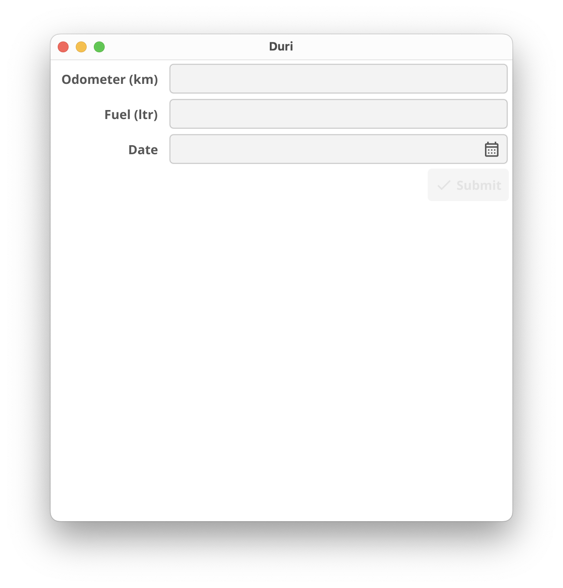

## Let's build our fuel log input page!

First, what data actually goes into a fuel log? Just 3 values, per our design spec: Distance, Volume and Time

Now, back to the main show in `main.go` file.

Fyne has something called an [`Entry`](https://docs.fyne.io/widget/entry/) widget that are equivalent of form inputs. And there is the eponymous [`Form`](https://docs.fyne.io/widget/form/) that is, quoting the docs, "...used to lay out many input fields with labels and optional cancel and submit buttons".

So, let's go add our 3 inputs into a form:

```go
odoInput := widget.NewEntry()
fuelInput := widget.NewEntry()
dateInput := &widget.DateEntry{}

form := &widget.Form{
Items: []*widget.FormItem{
  {Text: "Odometer (km)", Widget: odoInput},
  {Text: "Fuel (ltr)", Widget: fuelInput},
  {Text: "Date", Widget: dateInput},
}
```

While we're at it, let's increase the [size](https://docs.fyne.io/api/v2/fyne/size/#type-size) of our window to accommodate all stuff with `w.Resize(fyne.NewSize(512, 512))`.

Where are we processing the input, ye ask? Good question. `form` widget has an `onSubmit` hook that we can attach our function to. Let's add a simple log for now:

```go
package main

import (
  "log"

  "fyne.io/fyne/v2"
  "fyne.io/fyne/v2/app"
  "fyne.io/fyne/v2/widget"
)

func main() {
  a := app.New()
  w := a.NewWindow("Duri")

  odoInput := widget.NewEntry()
  fuelInput := widget.NewEntry()
  dateInput := &widget.DateEntry{}

  form := &widget.Form{
    Items: []*widget.FormItem{
      {Text: "Odometer (km)", Widget: odoInput},
      {Text: "Fuel (ltr)", Widget: fuelInput},
      {Text: "Date", Widget: dateInput},
    },
    OnSubmit: func() {
      log.Println("Form submitted:", odoInput.Text, fuelInput.Text, dateInput.Text)
    },
  }

  w.Resize(fyne.NewSize(512, 512))
  w.SetContent(form)
  w.ShowAndRun()
}
```

Go ahead and

```bash
go run .
```

Do you see a nice window with out 3 inputs?

<div style="width: 100%; text-align: center; padding: 0em; color: var(--emphasis-color)">



</div>

Try adding some values and click submit. Then check the logs. Should show something like:

```bash
2025/11/02 20:08:30 Form submitted: 1000 35.6 11/11/2025
```

Ah, but we aren't actually saving the values anywhere yet! Before we do that, let's create a structure for our fuel logs, then parse the strings we get from the form and create a new struct from them:

We'll define our struct like so (just above the `main` function):

```go
type FuelLog struct {
  odometer int
  fuel     float64
  date     time.Time
}
```

And back `onSubmit`, we parse our values like so:

```go
OnSubmit: func() {
  log.Println("Form submitted:", odoInput.Text, fuelInput.Text, dateInput.Text)
  odometer, err := strconv.Atoi(odoInput.Text)
  if err != nil {
    panic(err)
  }
  fuel, err := strconv.ParseFloat(fuelInput.Text, 64)
  if err != nil {
    panic(err)
  }
  date, err := time.Parse("02/01/2006", dateInput.Text)
  if err != nil {
    panic(err)
  }
  fl := FuelLog{odometer, fuel, date}
  log.Println(fl)
},
```

And go run again, input, submit, and check the logs. Do you see a...

```bash
2025/11/02 20:13:10 {1003 123.1 {0 63899193600 <nil>}}
```

...just below the previous log? That's our struct right there.

Check out this link of the exact code at this commit: [f70c60b](https://github.com/p-tupe/Duri/tree/f70c60b7fc562c279ade650606d0860e8f253856)

And thus concludes the bite-sized part-2. See ya in part-3!
