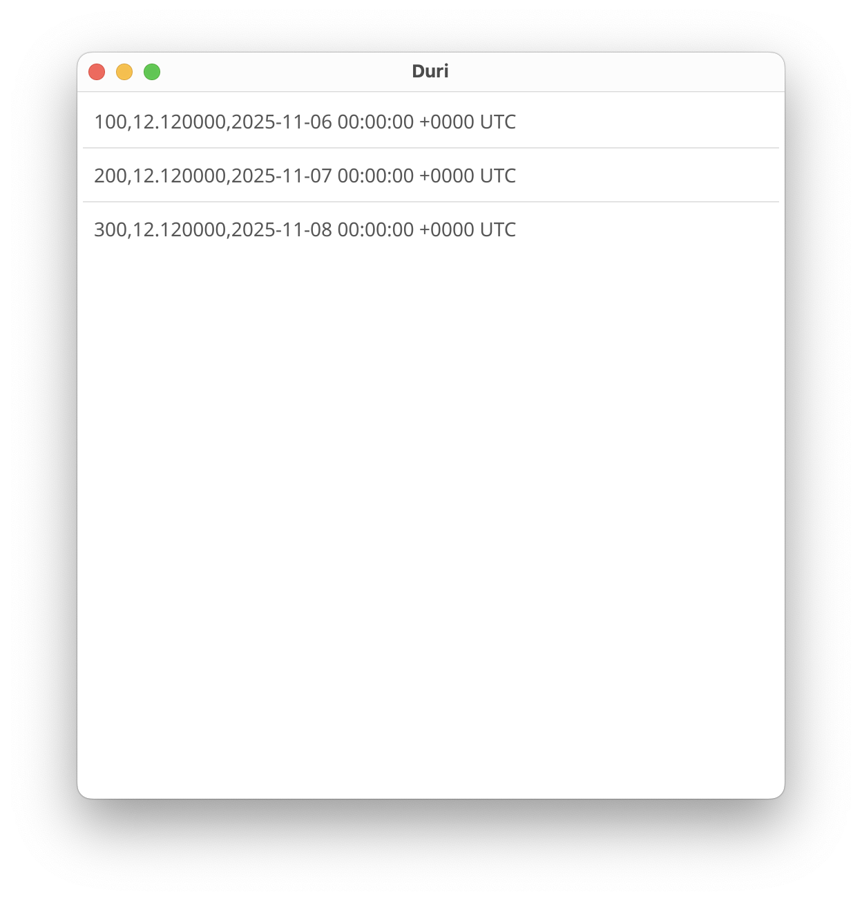

In the previous part, we managed to save our fuel logs into a persistent storage (`fuellogs.csv`) from the input page. In this part, let's create a view to see these saved logs!

> Check out the previous part here: [Part 3](/posts/go-fyne-part-3)

## How to view saved data?

Remember our rough sketch from the very first part under "what should we build" ? The first page (which we shall now call the "List Page") shows all the saved fuel logs in a list. It also has a + button to go to the input page, but we can tackle navigation in another part.

Before we get started though, now's a good time to refactor our code. I'll try to be as "complete" as possible in the blog post, but it is really not the best medium for expressing long form code-changes - if you get stuck, check out this [GitHub Diff](https://github.com/p-tupe/Duri/commit/1c398676b4c2222b26654b944f8d577f35102d7e) for what changed since the previous part.

Alright, refactor #1 - let's get the `logFile` out of `main`; create a new file (besides `main.go`) named `logFile.go` and move all logFile-related stuff into it. It should look something like so:

```go
var logFileURL = storage.NewFileURI("./fuellogs.csv")

func GetLogFileWriter() fyne.URIWriteCloser {
  writer, err := storage.Appender(logFileURL)
  if err != nil {
    log.Fatalln(err)
  }

  return writer
}
```

> All are `package main` and have respective imports! (Not shown in code snippets)

For refactor #2, we will move the `form` component out. Create a `widgets.go` file same as before and make a new function `GetForm` that takes in a logFile to write to and returns our input page widget:

```go
func GetForm(logFile fyne.URIWriteCloser) *widget.Form {
  odoInput := widget.NewEntry()
  fuelInput := widget.NewEntry()
  dateInput := &widget.DateEntry{}

  return &widget.Form{
    Items: []*widget.FormItem{
      {Text: "Odometer (km)", Widget: odoInput},
      {Text: "Fuel (ltr)", Widget: fuelInput},
      {Text: "Date", Widget: dateInput},
    },
    OnSubmit: func() {
      dump := fmt.Appendf(make([]byte, 0), "%s,%s,%s\n", odoInput.Text, fuelInput.Text, dateInput.Text)
      _, err := logFile.Write(dump)
      if err != nil {
        log.Fatalln(err)
      }
    },
  }
}
```

As a refactor #3, let's move our `FuelLog` type out to its own file as well. Create a `models.go` and copy-paste the `type FuelLog struct` into it. Finally, inside `main.go`, this is how our `main` function should look:

```go
func main() {
  a := app.New()
  w := a.NewWindow("Duri")

  logFileWriter := GetLogFileWriter()
  defer logFileWriter.Close()
  form := GetForm(logFileWriter)

  w.Resize(fyne.NewSize(512, 512))
  w.SetContent(form)
  w.ShowAndRun()
}
```

> Always run the code after a refactor to ensure functionality hasn't changed!

Woo! _Clean_, eh? :)

## Um... List Page?

Of course, of course. Let's see, checkout this little URL for docs on [List](https://docs.fyne.io/collection/list/). We _don't_ need it right now (since our data is tiny), but it won't take much effort to implement and is a good idea to know of regardless.

Inside `widgets.go`, create a function (just below `GetForm`) that returns us this list:

```go
func GetList(logFile fyne.URIReadCloser) *widget.List {
  // 1. Read from logFile
  // 2. Convert rows into fuel log struct slice
  // 3. Create a list widget from above list, and return it!
}
```

There are many ways to read from a file. `URIReadCloser` implements the `io.Reader` interface. I'll leave this part and the conversion to fuel log struct as an exercise for you - it'll help you learn `go` (and not in the scope of this post anyway). You will also need to implement a `GetLogFileReader` in `logFile.go` as a sibling to `GetLogFileWriter`.

> If you get stuck, remember to checkout the code in the GitHub diff linked above.

Right, so. The list. It's quite simple. Assuming you have a list of fuel logs, we return a list like so:

```go
func GetList(logFile fyne.URIReadCloser) *widget.List {
  fls := []FuelLog{}

  // 1. Read from logFile
  // 2. Convert rows into fuel log struct slice

  return widget.NewList(
    func() int {
      return len(fls)
    },
    func() fyne.CanvasObject {
      return widget.NewLabel("All Logs")
    },
    func(i widget.ListItemID, o fyne.CanvasObject) {
      o.(*widget.Label).SetText(fls[i].String())
    })
}
```

Back in `main.go`, we temporarily nuke the `GetForm` call and switch our content to show the shiny new list from `GetList`:

```go
func main() {
  a := app.New()
  w := a.NewWindow("Duri")

  logFileWriter := GetLogFileWriter()
  defer logFileWriter.Close()
  _ = GetForm(logFileWriter)

  logFileReader := GetLogFileReader()
  defer logFileReader.Close()
  list := GetList(logFileReader)

  w.Resize(fyne.NewSize(512, 512))
  w.SetContent(list)
  w.ShowAndRun()
}
```

If you don't already have some values in `fuellogs.csv`, open it and manually add some. Mine looks like so:

```csv
100,12.12,06/11/2025
200,12.12,07/11/2025
300,12.12,08/11/2025
```

Finally, let's `go run .` it; And behold our awesome new fuel log list!


<div style="width: 100%; text-align: center; padding: 0em; color: var(--emphasis-color)">



</div>

Hell Yeah! Thus, all the (two) pages of our app are (somewhat) done. We'll tackle mileage calculation and navigation in next part.

Update: Next part is up here on [Part 5](/posts/go-fyne-part-5)
